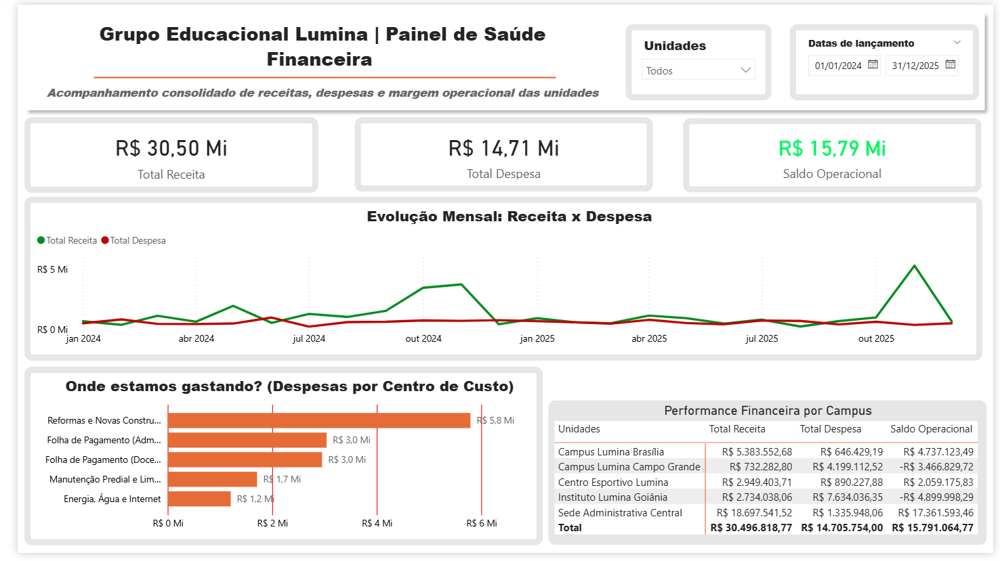

# 📊 Raio-X Financeiro Educacional | Inspirado no modelo UCOB

Fala, pessoal! Bem-vindos a mais um projeto do meu portfólio. 🚀

Imagina a seguinte situação: você gerencia uma rede gigante de colégios e faculdades (muito parecida com a complexidade administrativa da UCOB - União Centro-Oeste Brasileira). No final do ano, a conta bancária geral da empresa está no azul, bombando com milhões de lucro. **Mas será que todos os campus estão realmente dando lucro?**

O objetivo deste projeto não foi apenas fazer um "gráfico bonito", mas sim criar uma verdadeira máquina de **Raio-X financeiro** para a diretoria caçar onde o dinheiro está vazando.

## 🕵️‍♂️ O Desafio (A História por trás dos dados)
Eu criei o cenário de um grupo educacional fictício com 5 unidades. O grupo como um todo é um sucesso (lucro de quase R$ 16 Milhões), mas a diretoria estava "cega" para os detalhes operacionais. Eles não sabiam separar o que era investimento pesado do que era inchaço de gastos.

## 🛠️ Como eu resolvi (A Mão na Massa)
Como um bom profissional de dados, eu não usei planilhas prontas. Fui direto na raiz do problema simulando um ambiente real:

1. **O Motor (PostgreSQL + DBeaver):** Criei um banco de dados relacional do zero. Modelei as tabelas (Fatos e Dimensões) e injetei milhares de transações financeiras usando código SQL.
2. **O "Modo Gênio" no SQL:** Usei comandos pesados de `UPDATE` e `WHERE` para auditar a base, consertar erros de lançamento contábil direto no banco e simular os cenários de crise em unidades específicas.
3. **A Vitrine (Power BI):** Conectei o banco de dados e criei medidas em DAX para construir um Dashboard Executivo com design "Soft UI" (limpo, corporativo e sem cansar a vista do diretor).

## 💡 O Que Nós Descobrimos? (Insights de Negócio)
Ao cruzar os dados, o dashboard revelou três realidades completamente diferentes dentro da mesma empresa:

* 🏆 **Os Heróis:** A Sede Administrativa e o Campus Brasília são verdadeiras máquinas de fazer dinheiro. Eles seguram a rede nas costas.
* 🚧 **O Fogo Controlado (Goiânia):** Estão com um rombo de **-R$ 4.8 Mi**. O motivo? Obras. O gráfico mostra um pico gigantesco em *CAPEX (Reformas e Construções)*. É um prejuízo "bom", um investimento, mas que precisa ser vigiado.
* 🚨 **O Fogo Perigoso (Campo Grande):** Estão com **-R$ 3.4 Mi** no vermelho, mas por ineficiência. A receita de mensalidades deles é a menor do grupo, enquanto o gasto com *Folha de Pagamento* está explodindo. Muitos professores para poucos alunos. Intervenção imediata recomendada!

## 📂 Vem dar uma olhada!
Quer ver como ficou o resultado final e os códigos que eu usei por trás das cortinas? 
* 🖼️ **O Dashboard:** 
* 📄 **Versão em PDF:** Deixei o painel exportado em PDF para quem quiser ver em alta qualidade.
* 💻 **Os Códigos (SQL):** Na pasta `scripts_sql`, você encontra toda a engenharia de dados que eu fiz para manipular e auditar essa base.

---
*Curtiu o projeto? Bora trocar uma ideia no LinkedIn! E em breve trarei mais projetos (com foco no mercado gringo) por aqui.* 🌎
